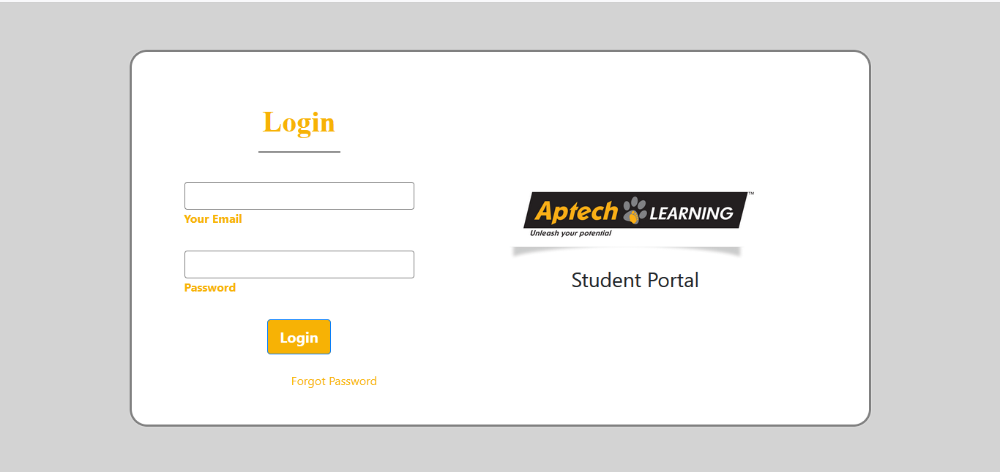

# 🎓 Student Portal Clone


A comprehensive Laravel-based **Student Portal system** for managing academic activities with real-time updates.



---

## ✨ Key Features

| Feature | Description |
|--------|-------------|
| 🔐 **Secure Authentication** | Role-based login system for students and admin |
| 📊 **Attendance Tracking** | Daily attendance records with visualization |
| 📝 **Grade Management** | View marks and academic performance |

---

## ⚙️ Installation

```bash
# Clone the repository
git clone https://github.com/MD-DaniyalJavadia/StudentPortalCloneAptech.git
cd StudentPortalCloneAptech

# Install PHP and JS dependencies
composer install
npm install

# Set up environment configuration
cp .env.example .env
# Then edit .env file with your DB credentials
DB_DATABASE=student_portal
DB_USERNAME=root
DB_PASSWORD=

# Generate application key
php artisan key:generate

 Database Setup
You can either run migrations and seeders or import the provided backup:

Option A: Run Migrations and Seeders

php artisan migrate --seed

Option B: Import from Backup
A backup of the project database is available.

📁 Location: appdata/student_portal_backup.sql

To restore it:

mysql -u root -p student_portal < appdata/student_portal_backup.sql


# Start local development servers
php artisan serve
npm run dev

student-portal/
├── app/               # Core application code
│   ├── Models/        # Eloquent models
│   ├── Http/          # Controllers and middleware
│   └── Providers/     # Service providers
├── database/          # Migrations and seeders
├── resources/         # Views and assets
├── routes/            # All application routes
├── public/            # Compiled assets
└── config/            # Configuration files

Want a quick look without setting up the backend?
Check out the 🔗 Live HTML/CSS Demo on Vercel ⚡
https://aptech-student-portal.vercel.app/
Note: This is a static version for UI demonstration purposes only.


🤝 Contributing
Fork the project

Create your feature branch: git checkout -b feature/AmazingFeature

Commit your changes: git commit -m 'Add some amazing feature'

Push to the branch: git push origin feature/AmazingFeature

Open a Pull Request


📧 Contact
Daniyal Javadia
Email: daniyaljavadiaworks@gmail.com

🔗 Project Link: https://github.com/MD-DaniyalJavadia/StudentPortalCloneAptech


